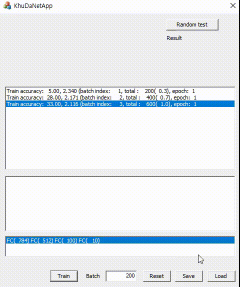

# KhuDaNet(MLP, DNN)
* KhuDaNet: Open source platform for neural networks (Kyung Hee University Data Analysis & Vision Intelligence Neural Networks)
* MLP, DNN
* C++

## Source file
* KhuDaNetLayer.cpp / KhuDaNetLayer.h
  + Fully connected layer
* KhuDaNet.cpp / KhuDaNet.h
  + Sequential network
  
## MNIST test
* Download train and test data from [http://yann.lecun.com/exdb/mnist/](http://yann.lecun.com/exdb/mnist/)
* Move to decompressed files to [Run] folder
* Run the following files
  + KhuDaNetApp.exe: Windows application using MFC
  + KhuDaNetConsole.exe: console application
* Network
  + Input layer: 28*28 pixel values ranging [0, 1]
  + Hidden layers: 2 hidden layers
  + Output layer: 10 node for 10 digits
  <br><br> </img>  
``` C++
struct CKhuDaNetLayerOption{
	CKhuDaNetLayerOption(unsigned int nLayerTypeIntput, int nImageCntInput, int nNodeCntIput, int nWidthInput, int nHeightInput, int nKernelSizeInput, int nActicationFnInput, double dLearningRateInput);
	unsigned int nLayerType;
	int nImageCnt;
	int nNodeCnt;
	int nW, nH;
	int nKernelSize;
	int nActicationFn;

	double dLearningRate;
};

void CKhuDaNet::AddLayer(CKhuDaNetLayerOption LayerOptionInput);
``` 

``` C++
CKhuDaNet m_Network;  // DNN
m_Network.AddLayer(CKhuDaNetLayerOption(KDN_LT_INPUT | KDN_LT_FC, 0, 28*28, 0, 0, 0, 0, 0.15));
m_Network.AddLayer(CKhuDaNetLayerOption(KDN_LT_FC, 0, 512, 0, 0, 0, KDN_AF_RELU, 0.15));
m_Network.AddLayer(CKhuDaNetLayerOption(KDN_LT_FC, 0, 100, 0, 0, 0, KDN_AF_RELU, 0.15));
m_Network.AddLayer(CKhuDaNetLayerOption(KDN_LT_FC | KDN_LT_OUTPUT, 0, 10, 0, 0, 0, KDN_AF_SOFTMAX, 0.15));
```

``` C++
m_Network.InitWeight(); // weight initialization
m_Network.TrainBatch(InputList, OutputList, nBatchSize, &Loss); // training
int nResult = m_Network.Forward(TestInput); // test
```

* Solution files for Visual Studio
  + KhuDaNetApp.sln: Windows application using MFC
  + KhuDaNetConsole.sln: console application
